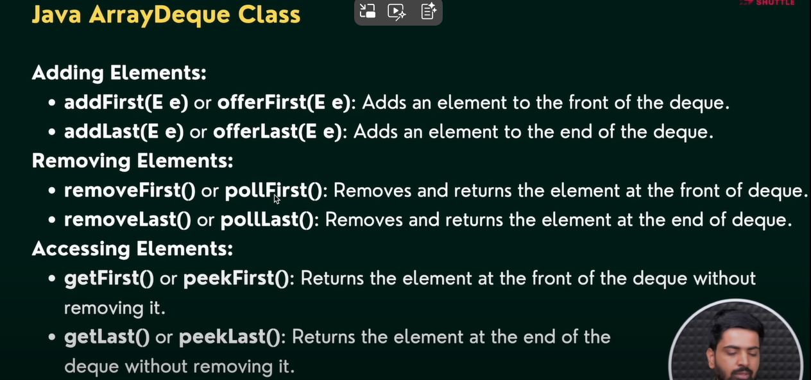

# collections
The java collections framework provides a set of 
interfaces and classes to implement various data structures
and algorithms. These interfaces include several methods to
perform different operations on collections.

Main Interfaces in the Collection Framework:

| Interface      | Description                                                                          |
| -------------- | ------------------------------------------------------------------------------------ |
| **Collection** | Root interface for most collections (List, Set, Queue)                               |
| **List**       | Ordered collection (allows duplicates)                                               |
| **Set**        | Unordered collection (no duplicates)                                                 |
| **Queue**      | Follows FIFO (First In, First Out)                                                   |
| **Map**        | Stores key-value pairs (not part of Collection interface, but part of the framework) |

Key Classes You Use:

| Interface | Common Implementations                             |
| --------- | -------------------------------------------------- |
| `List`    | `ArrayList`, `LinkedList`, `Vector`, `Stack`       |
| `Set`     | `HashSet`, `LinkedHashSet`, `TreeSet`              |
| `Queue`   | `PriorityQueue`, `ArrayDeque`                      |
| `Map`     | `HashMap`, `LinkedHashMap`, `TreeMap`, `Hashtable` |

### The collection interface is the root interface of the java collection framework

1) List : The list interface extends the collection interface and adds methods that are specific to lists, which are
ordered collections that allow duplicate elements. here are some methods present in the List interface but not in
collection interface

2) LinkedList: The LinkedList class of the java collections framework provides the functionality
of the linked list data structure(doubly linkedlist).
elements in the linked lists are not stored in sequence. Instead, they are scattered and connected through links(Prev and Next).

3) Vector: 

4) Stack

## Queue
Queue is an interface which an extends to the collection interface
and Queue should be implemented by "priority queue" && "ArrayDeque" && "LinkedList"

### Queue Methods

1) Deque
It should be implemented from ArrayDeque and the Deque.
which gives the ability to do an perform operations from both side.

## Stack and queue operations using ArrayDeque

## Set Interface

Meaning of "Mathematical Set" in Java:
A mathematical set:
*     Contains unique elements (no duplicates)
*     Has no defined order (in regular sets)
Java's Set interface models the same behavior.

## Maps 

